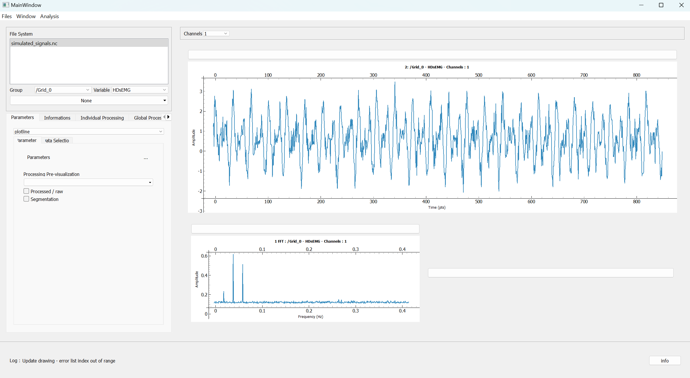

# EMG Explorer

A modular interface for signals visualization and processing

## Description

Filtering and having an overview of data are essential steps before feature extractions or any analytical process. This interface can provide a foundation to support this processing stage. The key word: modularity.

Built in the context of High Density Electromyography processing, this interface developed with PyQT, Pyqtgraph, Xarray/Datatree and Jinja, offers multi-channel visualizations in temporal and frequency domains. It enables users to generate reports with specific metrics, create and customize processing pipelines.  Designed to be as modular as possible, the interface allows users to incorporate their own features that fit their datasets by following a standardized code architecture.

Documentations are still in writtings, don't hesitate to email me if you have any question ! mtls.anais[at]gmail.com

## Getting Started

### Installing

Install the environnement with .yaml file or dependencies with requirements.txt

### Executing program

In EMG Explorer App, run EMGExplorer.py

## Authors

Anaïs Monteils
With the supervision of J. Laforet, K. Ghiatt, S, Rampnoux, C. Leblanc, A. Mazzolini

## To do

- Remove functions that are useless 
- Complete the implementation of the interactivity of the parameters layout of multi-channels visualization
- Expand tests and log feedbacks
- Complete UML !!

## License

This project is licensed under the GPL License - see the LICENSE.txt for details
